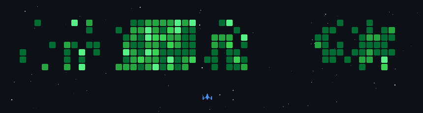

<h1 align="left">Hey, I’m Saad</h1>

<h3 align="left">
Backend Software Engineer | Python, FastAPI, NestJS, PostgreSQL & Frappe/ERPNext
</h3>

I build backend systems, business automation, and AI-integrated applications.
My recent work includes production ERP migration, payroll automation, REST APIs,
scheduled workflows, authentication, database optimization, and disaster-recovery tooling.

I primarily work with Python and TypeScript. I also use React and Next.js when
a product requires end-to-end delivery.

<h2 align="left">What I Work On</h2>

<ul>
  <li>Backend APIs and database architecture</li>
  <li>Frappe and ERPNext customization</li>
  <li>Business-process and scheduled-workflow automation</li>
  <li>Authentication, authorization, and application security</li>
  <li>AI, speech-processing, and third-party service integrations</li>
  <li>Full-stack product development with React and Next.js</li>
</ul>

<h2 align="left">Selected Work</h2>

<ul>
  <li>
    <strong>Frappe ERP Modernization & Payroll Automation</strong> 
    Migrated a production Frappe deployment from version 15 to a custom version
    16 container, developed overtime and payroll automation, and built a tested
    off-site backup and restoration workflow.
  </li>
   

  <li>
    <strong>
      <a href="https://verbally-frontend.vercel.app/">Verbally</a>
    </strong> 
    An AI-powered English-learning platform with pronunciation assessment,
    accent-focused feedback, CEFR progression, authentication, and real-time
    communication. Awarded 2nd position in the Best Final Year Project category
    at the Bahria University Open House.
  </li>
   

  <li>
    <strong>Nur</strong> 
    A scheduled Azkar broadcasting platform with a protected administration
    dashboard, PostgreSQL-backed delivery history, Cloudflare R2 storage,
    concurrency controls, and Discord integration.
  </li>
   

  <li>
    <strong>
      <a href="https://github.com/Saad-1719/FeelLog-Frontend">FeelLog</a>
    </strong> 
    A mental-wellness journaling application built with React, FastAPI, and
    PostgreSQL, featuring sentiment analysis and personalized feedback through
    Hugging Face and Gemini.
  </li>
</ul>

  More project details are available on
  <a href="https://www.saaadi.dev/">my portfolio</a>.

<h2 align="left">Tech Stack</h2>

  

<h2 align="left">Connect</h2>

<ul>
  <li><a href="https://www.saaadi.dev/">Portfolio</a></li>
  <li><a href="https://www.linkedin.com/in/saaadi/">LinkedIn</a></li>
  <li><a href="mailto:chsaad1171@gmail.com">Email</a></li>
</ul>

<h2 align="left">GitHub Activity</h2>

  
    
  

 

  

